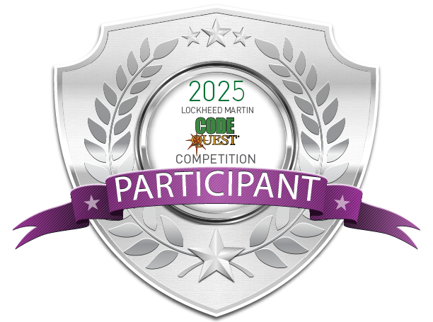

# Lockheed Martin Code Quest - Contest Solutions

<p align="center">
  
  
</p>

<p align="center">
  
  
  <br>
  
  
 <!---->
  
  
  
  
  
  
  
</p>

---

> **Note:** This repository was created for **learning and preparation purposes** — to sharpen algorithm, data structure, and competitive programming skills ahead of participating in newer editions of the Lockheed Martin Code Quest contest. Code Quest is a **team contest**, and I have taken part in **2** editions so far as part of a team: **2025** (placed **4th**) and **2026** (placed **8th**). It is not an official Lockheed Martin resource.

This repository is a structured archive of my solutions to past **Lockheed Martin Code Quest** contest problems, sourced from the [Code Quest Academy](https://lmcodequestacademy.com/). All solutions included here have been **submitted to and confirmed as correct** on the Code Quest Academy site.

---

## 📊 Progress (as of 16 September 2026)

| Tier      | Status |    Progress    | Completion |        Solved |
| :-------- | :----: | :------------: | ---------: | ------------: |
| Practice  |   ✅   |   ▰▰▰▰▰▰▰▰▰▰   |    100.00% |         2 / 2 |
| Easy      |   🟡   |   ▰▰▰▰▰▰▰▰▰▱   |     89.29% |     100 / 112 |
| Medium    |   🟡   |   ▰▰▰▰▰▰▰▰▰▱   |     91.96% |     103 / 112 |
| Hard      |   🟡   |   ▰▱▱▱▱▱▱▱▱▱   |     13.58% |       11 / 81 |
| &nbsp;    | &nbsp; |     &nbsp;     |     &nbsp; |        &nbsp; |
| **Total** | **📊** | **▰▰▰▰▰▰▰▱▱▱** | **70.36%** | **216 / 307** |

---

## 🧪 Testing Harness

Every solution in this repo is checked against its stored input/output test cases. You can install and run it using either `uv` (recommended) or standard `pip`.

### Method 1: Using `uv` (Recommended)

`uv` is a fast, modern Python package manager that handles dependencies and virtual environments automatically.

**Install `uv` (If needed)**

```bash
curl -LsSf https://astral.sh/uv/install.sh | sh
```

**Clone and setup**

```bash
git clone https://github.com/JakubGawron/lockheed-code-quest-solutions
cd lockheed-code-quest-solutions
```

**Install dependencies**

```bash
uv sync
```

This installs the exact dependency versions pinned in [`uv.lock`](./uv.lock), ensuring a reproducible environment.

**Running tests:**

```bash
uv run pytest -v                 # run everything
uv run pytest -v -k addiply      # run one problem (matches folder name)
uv run pytest -x                 # stop at first failure
uv run pytest --tb=short         # shorter failure output
uv run pytest -n auto            # parallel using all available corespytest
uv run pytest -n 4               # parallel using 4 cores
```

### Method 2: Using Standard Python

**Clone the repository**

```bash
git clone https://github.com/JakubGawron/lockheed-code-quest-solutions
cd lockheed-code-quest-solutions
```

**Create a virtual environment**

```bash
python -m venv .venv
source venv/bin/activate  # On Windows: venv\Scripts\activate
```

**Install depenencies**

```bash
python -m pip install "pytest>=9.1.1" "pytest-xdist>=3.8.0"
```

**Running tests** (identical commands once the venv is active — just drop the `uv run` prefix):

```bash
pytest -v                 # run everything
pytest -v -k addiply      # run one problem (matches folder name)
pytest -x                 # stop at first failure
pytest --tb=short         # shorter failure output
pytest -n auto            # parallel using all available corespytest
pytest -n 4               # parallel using 4 cores
```

---

## Running individual / scoped tests with `-k`

Solutions are organized by difficulty into folders (`practice/`, `easy/`, `medium/`, `hard/`), each containing one subfolder per problem. Pytest's `-k` flag does keyword matching against test names and node IDs, which lets you filter by difficulty, by problem name, or both at once:

```bash
uv run pytest -v -k "easy"                      # run every problem under the "easy" tier
uv run pytest -v -k "hard"                      # run every problem under the "hard" tier
uv run pytest -v -k "addiply"                   # run only the "addiply" problem, regardless of tier
uv run pytest -v -k "hard and addiply"          # run "addiply" specifically from the hard tier
uv run pytest -v -k "easy or medium"            # run everything in easy OR medium
uv run pytest -v -k "hard and not addiply"      # run all hard problems except addiply"
```

---

## License

This project is licensed under the [MIT License](https://choosealicense.com/licenses/mit/).

See the [`LICENSE`](./LICENSE) file for details.

---

## Author / Contact

- **Author:** Jakub Gawron
- **GitHub:** [github.com/JakubGawron](https://github.com/JakubGawron)
- **Repository:** [github.com/JakubGawron/lockheed-code-quest-solutions](https://github.com/JakubGawron/lockheed-code-quest-solutions)
- **Contact:** [contact.jakub.gawron@gmail.com](mailto:contact.jakub.gawron@gmail.com)
